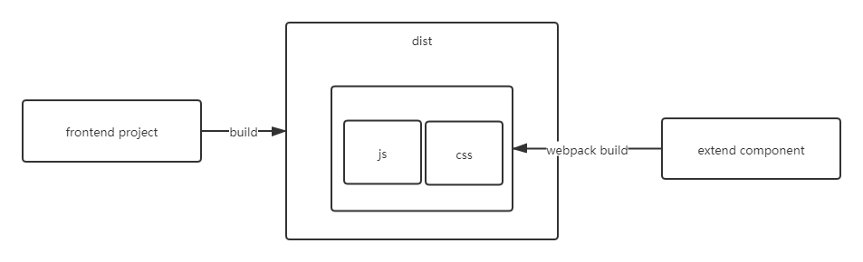

# webpack4 打包 vue3 单文件

## 背景

目前存在需求，在打包的 `dist` 目录下，希望交付给客户后，客户能够继续集成进自己的组件。

由于 `.vue`文件 无法直接加载，我们想单独借助 [webpack](https://webpack.js.org/) 将需要集成的组件先打包生成 `js`、`css` 文件后，在通过 `script` 和 `link` 引入到 `index.html` 中，让项目组件通过 `window` 下的拿到组件 `esModule` 的模块，从而达到引入组件的目的。



## 配置

首先请安装

```cmd
npm i webpack@4.46.0 webpack-cli@4.7.2 -D
```

### tips

`i` `-D` 分别为 `install` 和 `--save-dev` 的缩写

相关语法请参考 [npm](https://docs.npmjs.com/cli/v6/commands/npm-install)

项目根目录下创建文件 `webpack.config.js`

```js
// webpack.config.js
module.exports {
  entry: {},
  output: {},
  mode: "",
  module: {},
  resolve: {},
  plugins: []
}
```

首先我们首先配置打包入口，根据 [entry](https://webpack.js.org/concepts/#entry) 说明，我们：

```json
{
  "entry": "./src/myInput.vue"
}
```

其中 `entry` 的地址，为扩展组件 `myInput.vue` 位置，所有的组件都放在 `src` 目录下。

同理输出目录，根据 [output](https://webpack.js.org/configuration/output/) 配置为：

```json
{
  output: {
    filename: '[name].js',
    path: path.resolve(__dirname, './dist'),
    library: '[name]' // 打包输出的属性名（入口）
  }
}
```

这样打包后的 js 文件会自动生成在 dist 目录下, 并且名称与打包前文件名一致。

这样出入口的配置已经完成，但是要能够打包 `vue` 组件，我们还要配置相应的 `loader`。

注意的是 `vue` 的 `loader` 需要是 `@next` 版本，且编译器的 `compiler` 的版本与 `vue` 版本必须保持一致。

```cmd
npm i vue@next vue-loader@next @vue/compiler-sfc -D
```

同时 插件([plugins](https://webpack.js.org/configuration/plugins/))我们需要搭配 `VueLoaderPlugin`。

```json
{
   plugins: [
    new VueLoaderPlugin()
  ]
}
```

因为组件中可能会用到 `scss`，或引用图片等资源，这里顺便补充常用 `loader`

```cmd
npm i css-loader file-loader sass sass-loader style-loader -D
```

注意，`vue3` 之后推荐使用 `dart-sass` 代替 `node-sass`，详情参照 [dart-sass](https://www.sasscss.com/dart-sass)。

`typescript` 相关

```cmd
npm i ts-loader typescript -D
```

`babel` 相关

```cmd
npm i babel-loader -D
```

准备完成后，我们要进行模块规则配置 (`module rules`)，及解析不同的内容我们要采用哪一个`loader`

```json
{
  module: {
    rules: [
      {
        test: /\.vue$/,
        use: ['vue-loader']
      },
      {
        test: /\.scss$/,
        use: ['style-loader', 'css-loader'],
      },
      {
        test: /\.css$/i,
        use: ['style-loader', 'css-loader']
      },
      {
        test: /\.(png|jpe?g|gif)$/i,
        use: ['file-loader'],
      },
      {
        test: /\.js$/,
        exclude: /node_modules/,
        use: ['babel-loader']
      }
    ]
}
```

此时，运行 `build` 脚本，我们便能得到 `src` 下组件输出在 `dist` 目录下的 `js` 文件。

```cmd
npm run webpack --config webpack.config.js
```

## 优化

### 批量操作

因为上述配置只能每次通过配置一个 `entry` 来设置入口，并打包输入一对一的文件，如果需要打包的文件很多，需要多次配置 `entry` 再 `build`, 过程十分繁琐，可以通过 `fs` 来辅助配置多个入口。

```js
const entries = {};

const files = fs.readdirSync('./src');

files.forEach(function (filename) {
  const stat = fs.lstatSync('./src/' + filename);
  if (stat.isFile() === true) {
    const ext = path.extname(filename);
    if (ext == '.vue') {
      const basename = path.basename(filename, ext);
      entries[basename] = `./src/${filename}`;
    }
  }
});
```

这样我们将目标目录下所有以 `.vue` 结尾的文件全部放入 `entry` 中，在打包时就可以动态生成入口，同时打包所有组件了。

### css 文件分离

因为正常打包时，`css` 会包含在 js 模块内部，会导致加载时间延长，所以我们希望将 `css` 内容打包时能单独分离出来，`webpack4` 我们使用 `mini-css-extract-plugin` 插件来实现。

```json
{
  output: {
    filename: '[name]/index.js',
    path: path.resolve(__dirname, './dist'),
    library: '[name]'
  },
  module: {
    rules: [
      {
        test: /\.scss$/,
        use: [MiniCssExtractPlugin.loader, 'css-loader'],
      },
      {
        test: /\.css$/i,
        use: [MiniCssExtractPlugin.loader, 'css-loader']
      }
    ]
  },
  plugins: [
    new MiniCssExtractPlugin(
      {
        filename: './[name]/index.css'
      }),
  ]
}
```
这样配置，产出文件会在 `dist` 目录下生成对应文件名的目录，并且组件的 `js` 与 `css` 文件都会命名为 `index` 在该目录下生成。

可以阅读 [Webpack Plugin](https://webpack.docschina.org/plugins/html-webpack-plugin/) 获取更多遍历插件。

完整配置代码如下

```js
/**
 * webpack.config.js
 * @author  hfutsora
 */

const fs = require('fs');
const path = require('path');
const { VueLoaderPlugin } = require('vue-loader')
const MiniCssExtractPlugin = require("mini-css-extract-plugin");

let entries = {};

const files = fs.readdirSync('./src')

files.forEach(function (filename) {
  let stat = fs.lstatSync("./src/" + filename)
  if (stat.isFile() === true) {

    const ext = path.extname(filename);
    if (ext == ".vue") {
      const basename = path.basename(filename, ext);
      entries[basename] = `./src/${filename}`;
    }
  }
})

const defaultConfig = {
  entry: {},
  output: {
    filename: '[name]/index.js',
    path: path.resolve(__dirname, './dist'),
    library: '[name]'
  },
  mode: "production",
  module: {
    rules: [
      {
        test: /\.vue$/,
        use: ['vue-loader']
      },
      {
        test: /\.scss$/,
        use: [MiniCssExtractPlugin.loader, 'css-loader'],
      },
      {
        test: /\.css$/i,
        use: [MiniCssExtractPlugin.loader, 'css-loader']
      },
      {
        test: /\.(png|jpe?g|gif)$/i,
        use: ['file-loader'],
      },
      {
        test: /\.js$/,
        exclude: /node_modules/,
        use: ['babel-loader']
      }
    ]
  },
  resolve: {
    extensions: ['.tsx', '.ts', '.js', 'json'],
  },
  plugins: [
    new VueLoaderPlugin(),
    new MiniCssExtractPlugin(
      {
        filename: './[name]/index.css'
      }),
  ]
}

module.exports = Object.assign(defaultConfig, { entry: entries })

```
